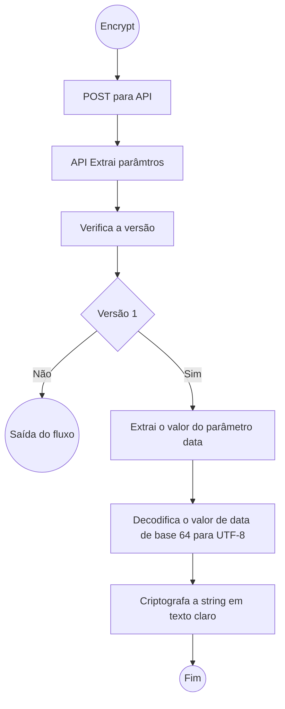

# qrcode_secure_backend
[[_TOC_]]

- [x] Funções básica de criptografia assimétrica da API
- [ ] Incluir recursos de criptografia simétrica
- [ ] Incluir verificação de versão da API
- [ ] Ajustar retorno JSON acrescentando a chave simétrica (AES-256) e _hash_ (SHA-256) dos dados em texto claro.

# Installation

Insert a file "conf.js" in the root folder with the following data

const salt = "asdfb351fd6g12kfghd#$ASDVdf4fsd"; // Random data 
const password = "sdfasdf@#%ff2qfgsdf4asdfA";
const symmetric_passphrase = "sdafdf$%Dsdfrwt24r52ad";


module.exports = { salt, password, symmetric_passphrase };

Insert a file a private.pem file and a public.pem file


Run in the terminal (Windows ou Linux):

```console

user@server:~$ npm install
user@server:~$ node server.js

Server running on port 22633
```

# Accessing the API

By default, the server will run in port 22633

## Encrypt

Criptografa a informação utilizando duas chaves criptográficas, uma simétrica e outra assimétrica. 

Devido as restrições da criptografia assimétrica RSA, a informação criptografada não pode ser maior que a chave (4096 bits), ou seja, a informação em texto claro não pode ultrapassar 512 bytes, além de serem bastante lentas.

Algoritmos de criptografia simétrica com AES-256, são rápidos e bastante seguros. Nessa caso a API irá gerar uma senha aleatória de 8 caracteres que irá cifrar a informação desejada. 
Esta senha, por sua vez, será criptografada com a chave privada e armazenada junto com o conteúdo.


No exemplo abaixo temos uma _string_ de 296 caracteres (ou 296 bytes) que armazenamem informação em Base64.

`
IlRlc3RlIGRlIGF1dGVudGljYcOnw6NvIGRlIGRvY3VtZW50byBkaWdpdGFsIiwiSm9zw6kgZGEgU2lsdmEgT2xpdmVpcmEiLCIyMDIwMDQxMTEzMjIwMyIs
IjEyMzQ1IiwiUmljYXJkbyBkZSBTb3V6YSBNYWlhIiwiMTQwMDEzNSIsIkRvY3VtZW50byBUZXN0ZSIsIk9mw61jaW8iLCJkMmE5MzAxYzAxMGNhNmUwMzNi
ZTdhNzNhMWVmZjNiOWE0ODBhYjIwYTZmYjc5NmY3YmY2Mjk2MCIKICAgIA==
`

Contudo, devemos considerar o valor o conteúdo sem codificação, que neste exemplo, tem apenas 223 bytes.

`
"0","Teste de autenticação de documento digital","José da Silva Oliveira","20200411132203","12345","Ricardo de Souza Maia",
"1400135","Documento Teste","Ofício","d2a9301c010ca6e033be7a73a1eff3b9a480ab20a6fb796f7bf62960"
`

A estrutura de dados seguirá o seguinte formato com valores posicionais para maior compactação. O primeiro elemento especifica o tipo de conteúdo e como deverá ser interpretado 
no momento da renderização pelo App PWA.

 - 0 – **Texto Puro**
   - O texto puro irá interpretar os sinais de quebra de linha (`\n`) e retorno de carro (`\r`) sem qualquer outro tipo de formatação.
 - 1 – **Documento** (Conforme metadados descritos no Decreto Federal 10.278/2020):
   - Assunto
   - Autor
   - Data e local
   - Identificador único
   - Nome do Responsável pela digitalização
   - Matrícula do Responsável pela digitalização
   - Título
   - Tipo documental - Divisão de espécie documental que reúne documentos por suas características comuns em termos de fórmula diplomática, natureza de conteúdo ou técnica do registro, tais como ata, ofício, memorando, fotografia, planta baixa.
   - Hash (sha-2)
   - Classe
   - Data do documento original
   - Destinação
   - Gênero - Reunião de espécies documentais que se assemelham por seus caracteres essenciais, particularmente o suporte e a forma de registro da informação, como documentação audiovisual, documentação cartográfica, documentação iconográfica, documentação informática, documentação micrográfica, documentação textual.
   - Prazo de guarda
 - 2 – **Projeto de Incêndio**
 - 3 – **Diploma / Certificado**
 - 4 – **Documento de Identificação**


`

### Method
 - POST

### Parâmetros
 - _version_: Versão da API de criptografia.
 - _data_: Informação que será criptografada codificada em Base64.

### Retorno

O retorno da chamada será um JSON. O primeiro elemento sempre será a versão do algoritmo. Para **versão 1** temos os seguintes elementos:
 - v - versão do algoritmo;
 - k - a chave simétrica criptografada e codificada em Base64;
 - d - dados criptografados e codificados em Base64; e
 - h - _hash_ SHA-256 dos dados em texto claro.

#### Exemplo

Chamada usando curl no terminal (sem as quebras de linha):

```console
curl --location --request POST 'http://localhost:22633/encrypt?version=1&data=IlRlc3RlIGRlIGF1dGVudGljYcOnw6NvIGRlI
GRvY3VtZW50byBkaWdpdGFsIiwiSm9zw6kgZGEgU2lsdmEgT2xpdmVpcmEiLCIyMDIwMDQxMTEzMjIwMyIsIjEyMzQ1IiwiUmljYXJkbyBkZSBTb3V6
YSBNYWlhIiwiMTQwMDEzNSIsIkRvY3VtZW50byBUZXN0ZSIsIk9mw61jaW8iLCJkMmE5MzAxYzAxMGNhNmUwMzNiZTdhNzNhMWVmZjNiOWE0ODBhYjI
wYTZmYjc5NmY3YmY2Mjk2MCIKICAgIA%3D%3D'
```

Retorno da API em formato JSON (sem as quebras de linha):

```json
{"version":"1",
"data":"nmzA6ohZ67CIHCcWe7LSX2YO7eX2feMTSNGtY3IzixiCuCXUaEKjTdnMw2FuOKAUzWsV/4cV8H+dyUF+kpqVrsOLsjBHsKPYN0hbuODlgRN3oukwVA2RVoHrHmzNEkG+I6YrWZAu7R9BGGsa5iBH1RbDbb1w5/9jwhUxuc+IPohubwiNBAlOEUAJ5B7MOzezlgL39H0K5i81fvtuedUk95cvlZvwfxu5eqEYvOR3eYoSLJGf+MPO8E65hRl2pxyXuQaYPv5lTUeyaWH3fflaliu/lyK3VM0vEcVsvR3FIQWJkdRT8wWmgj0oV/uiVjsrss1votszv7tD21fMVoI/M5tG3Rdapqn/zGFdcJu/594F3piUXB9JBceITXdQe/40q7kgqm0FCysrf4DBmIbQUUqzjjKhRBtxnjcPm0+rt3+WIM95leFRQzjNMYNuHpshWEpYIe6NhRG4HoMUTUqPg9aWjrzeEvStHNmDm0wli8rX2QIQe47q2pAPiSTAAAlCuKdGIMulZ6mOi0zrXrFSlfRYT2GfgZ4urSNzFTcLoAYnazMaSOKC4WrNVRpiyeKWKD2jd1llikWL55AHV4+XkAGXD9uiRorJjGuacp4kPm61k/51xhA9x5jwJ7/RySGZh/UvcluY"
}
```


### QRCode - Browser

http://localhost:22633/qrcode?version=1&data=nmzA6ohZ67CIHCcWe7LSX2YO7eX2feMTSNGtY3IzixiCuCXUaEKjTdnMw2FuOKAUzWsV/4cV8H+dyUF+kpqVrsOLsjBHsKPYN0hbuODlgRN3oukwVA2RVoHrHmzNEkG+I6YrWZAu7R9BGGsa5iBH1RbDbb1w5/9jwhUxuc+IPohubwiNBAlOEUAJ5B7MOzezlgL39H0K5i81fvtuedUk95cvlZvwfxu5eqEYvOR3eYoSLJGf+MPO8E65hRl2pxyXuQaYPv5lTUeyaWH3fflaliu/lyK3VM0vEcVsvR3FIQWJkdRT8wWmgj0oV/uiVjsrss1votszv7tD21fMVoI/M5tG3Rdapqn/zGFdcJu/594F3piUXB9JBceITXdQe/40q7kgqm0FCysrf4DBmIbQUUqzjjKhRBtxnjcPm0+rt3+WIM95leFRQzjNMYNuHpshWEpYIe6NhRG4HoMUTUqPg9aWjrzeEvStHNmDm0wli8rX2QIQe47q2pAPiSTAAAlCuKdGIMul/Z6mOi0zrXrFSlfRYT2GfgZ4urSNzFTcLoAYnazMaSOKC4WrNVRpiyeKWKD2jd1llikWL55AHV4+XkAGXD9uiRorJjGuacp4kPm61k/51xhA9x5jwJ7/RySGZh/UvcluY


Você também pode realizar os testes na API com o software Postman (https://www.postman.com/downloads/)


https://mermaid-js.github.io/mermaid/
